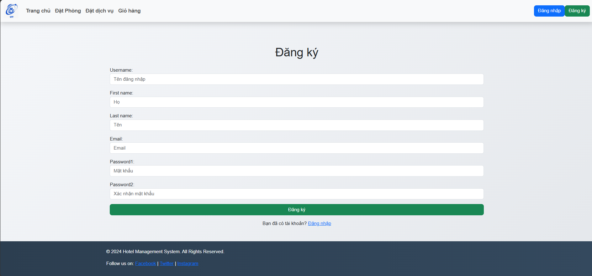
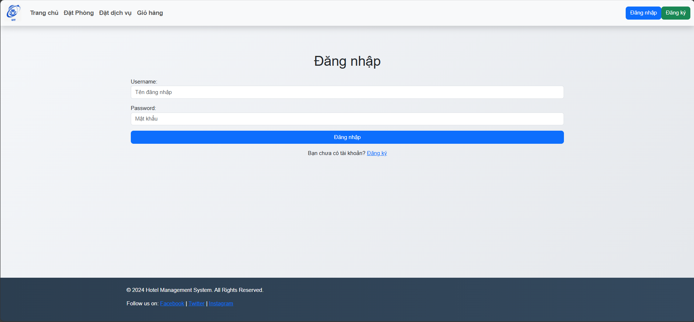
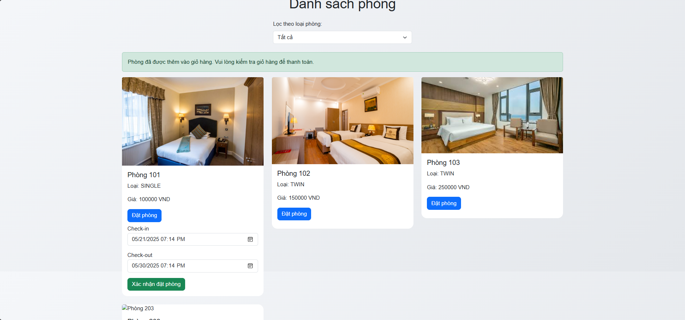
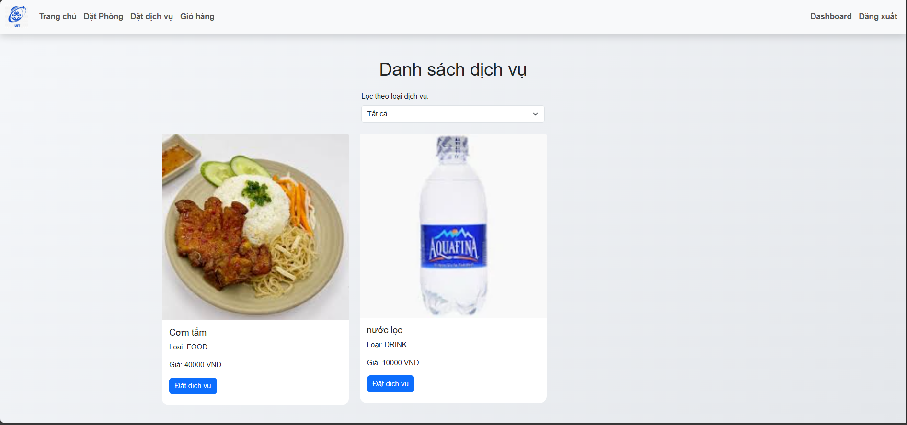
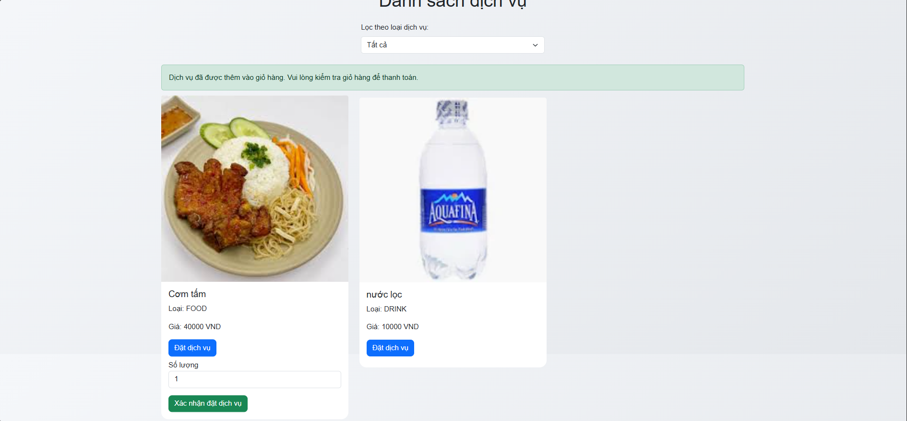
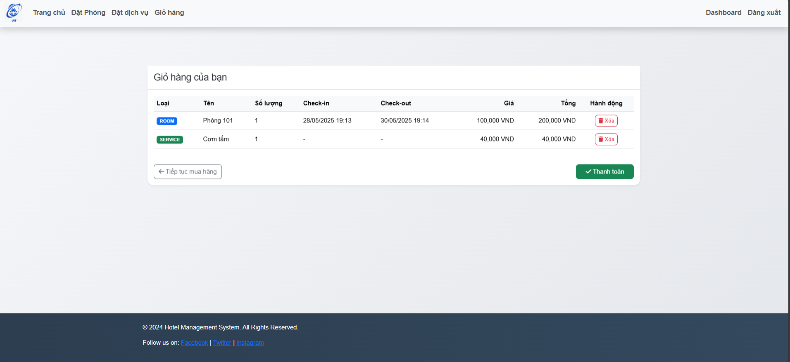
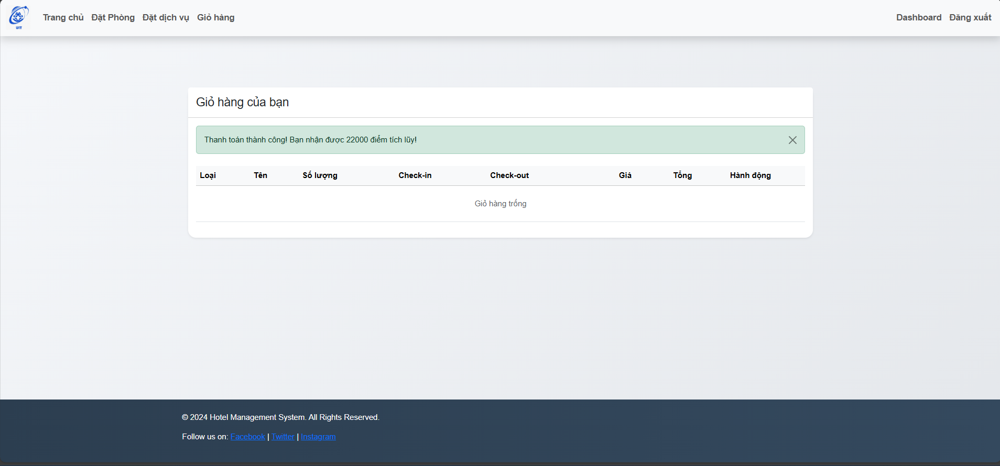
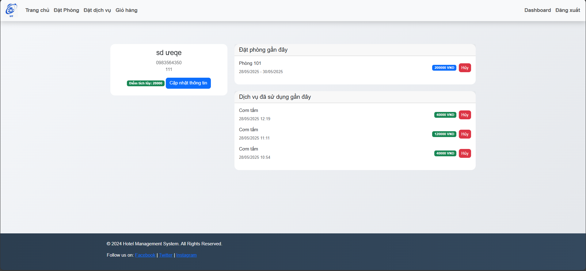

# Hệ thống Quản lý Khách sạn

## Tính năng

### Người dùng
- **Đặt Phòng**: Xem và đặt phòng theo ngày
- **Đặt Dịch vụ**: Đặt các dịch vụ như đồ ăn, đồ uống, spa
- **Giỏ hàng**: Quản lý đơn đặt phòng và dịch vụ
- **Bảng điều khiển**: Theo dõi lịch sử đặt phòng và dịch vụ
- **Thông tin cá nhân**: Cập nhật thông tin cá nhân
- **Điểm tích lũy**: Tích điểm khi đặt phòng và dịch vụ

### Quản trị viên
- **Quản lý Phòng**: Thêm, sửa, xóa thông tin phòng
- **Quản lý Dịch vụ**: Thêm, sửa, xóa thông tin dịch vụ
- **Quản lý Người dùng**: Quản lý tài khoản và thông tin người dùng

## Cài đặt

### Các bước cài đặt
1. Tải mã nguồn:
   ```bash
   git clone https://github.com/PhamKhoa180524/IE221.git
   cd IE221
   ```

2. Tạo và kích hoạt môi trường ảo:
   ```bash
   python -m venv venv
   source venv/bin/activate  # Trên Windows: venv\Scripts\activate
   ```

3. Cài đặt các gói phụ thuộc:
   ```bash
   pip install -r requirements.txt
   ```

4. Thực hiện migrate cơ sở dữ liệu:
   ```bash
   python manage.py migrate
   ```

5. Tạo tài khoản quản trị viên:
   ```bash
   python manage.py createsuperuser
   ```

6. Khởi chạy máy chủ phát triển:
   ```bash
   python manage.py runserver
   ```

7. Truy cập ứng dụng trong trình duyệt:
   ```
   http://127.0.0.1:8000/
   ```

## Cấu trúc dự án

qlks/ ├── hotel/ │ ├── migrations/ │ ├── static/ │ │ └── hotel/ │ │ └── images/ │ │ ├── brand.webp │ │ ├── hoboi.jpg │ │ ├── nhahang.jpg │ │ ├── phong.jpg │ │ └── spa.webp │ ├── templates/ │ │ └── hotel/ │ │ ├── base.html │ │ ├── book_room.html │ │ ├── cart.html │ │ ├── dashboard.html │ │ ├── home.html │ │ ├── login.html │ │ ├── profile.html │ │ ├── register.html │ │ └── service_booking.html │ ├── admin.py │ ├── forms.py │ ├── models.py │ ├── urls.py │ └── views.py ├── qlks/ │ ├── settings.py │ ├── urls.py │ └── wsgi.py ├── README.md ├── requirements.txt └── manage.py

## Hướng dẫn sử dụng

### Đăng ký và Đăng nhập
1. Truy cập trang đăng ký để tạo tài khoản mới
2. Điền thông tin cá nhân và mật khẩu
3. Sau khi đăng ký sẽ được tự động đăng nhập




### Đặt Phòng
1. Chọn "Đặt Phòng" từ menu
2. Lọc phòng theo loại nếu cần
3. Chọn phòng và điền thông tin check-in, check-out
4. Thêm vào giỏ hàng




### Đặt Dịch vụ
1. Chọn "Đặt dịch vụ" từ menu
2. Lọc dịch vụ theo loại
3. Chọn dịch vụ và số lượng
4. Thêm vào giỏ hàng




### Thanh toán
1. Vào giỏ hàng
2. Kiểm tra các mục đã đặt
3. Nhấn "Thanh toán" để hoàn tất




### Quản lý Đơn hàng
1. Vào "Bảng điều khiển"
2. Xem lịch sử đặt phòng và dịch vụ
3. Có thể hủy các đơn đặt phòng/dịch vụ



## Công nghệ sử dụng
- **Framework**: Django 5.2.1
- **Frontend**: HTML5, CSS3, Bootstrap 5
- **Database**: SQLite3
- **Authentication**: Django Authentication System
- **Icons**: Font Awesome 6
- **JavaScript**: Native JS + Bootstrap JS

## Tính năng sắp tới
- [ ] Tích hợp thanh toán trực tuyến
- [ ] Thêm đánh giá và nhận xét
- [ ] Hệ thống thông báo realtime
- [ ] Tích hợp bản đồ
- [ ] App mobile
